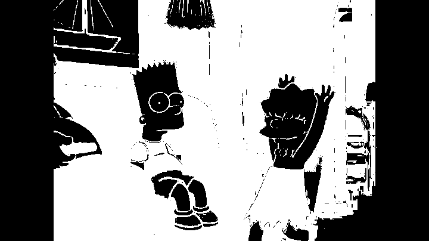
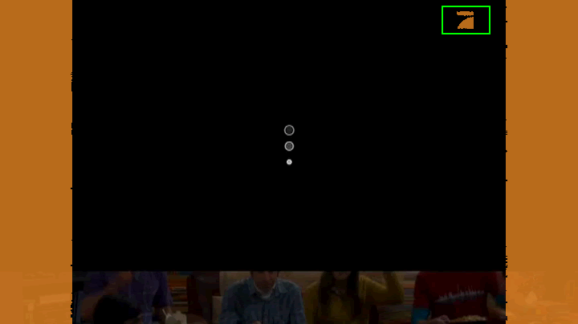

## Commercial Detection Algorithm
The commercial detection algorithm (CODA) is a simple way to detect similar patterns in a movie. This was a project for the subject **Ton und Videoverarbeitung (TVVER)**.

### Implementation
The whole project is implemented in java with the **EtherGL** framework.

#### Training
At the beginning the algorithm first has to learn what the most important parts of the movie frames are. These part will be used to recognize if something has changed in the movie. Often it is the **logo** of the channel which will be visible during program and which will be hidden during commercial.

*Iimage 1: 400 training steps*

So it is **important** to train the algorithm first with some program frames. About 200 should be enough, but the more the better the result will be.

In **image 1** you can see the progress which the algorithm is doing during training over 400 frames.

#### Detection
After the training phase the detection phase can begin. There the algorithm just takes the current frame and tries to find differences betweend the learned frame and the current frame. Of course the algorithm just takes the relevant parts of the learned frame.

Here on **image 2** you can see an example where the algorithm finds a new commercial block because it can't find the relevant logo of the channel:

*Iimage 2: failed recognition of the logo*

The black image in the background is the commercial opening of the channel pro7. There is no pro7 logo in the right upper corner. The one in orange with the green rectangle around it is the **trained** image from the training phase. So the algorithm decides to mark this part of the movie as commercial.

### About
Implemented in a six hour coding session at Starbucks.

2015 (c) Sulamith & Florian!